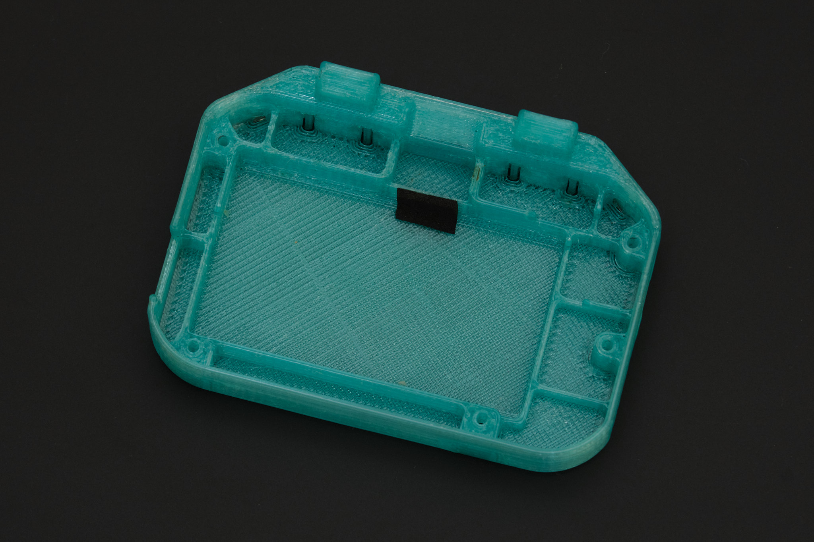
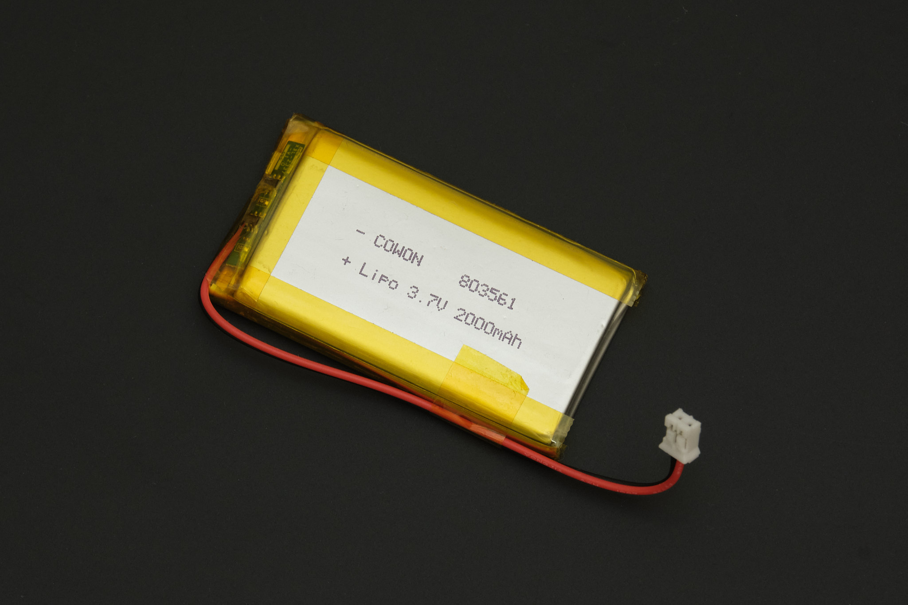
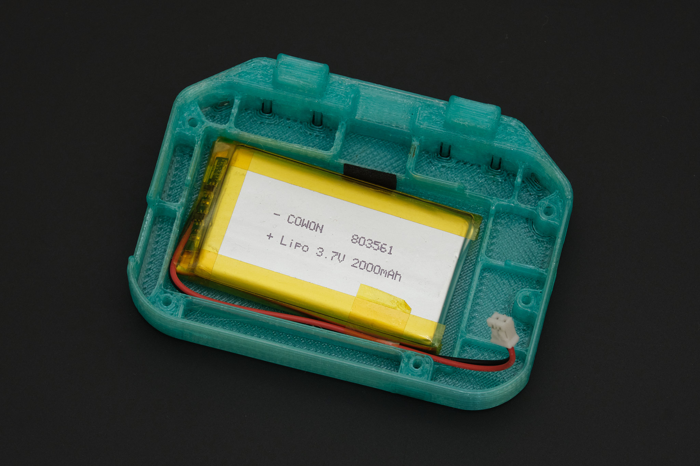
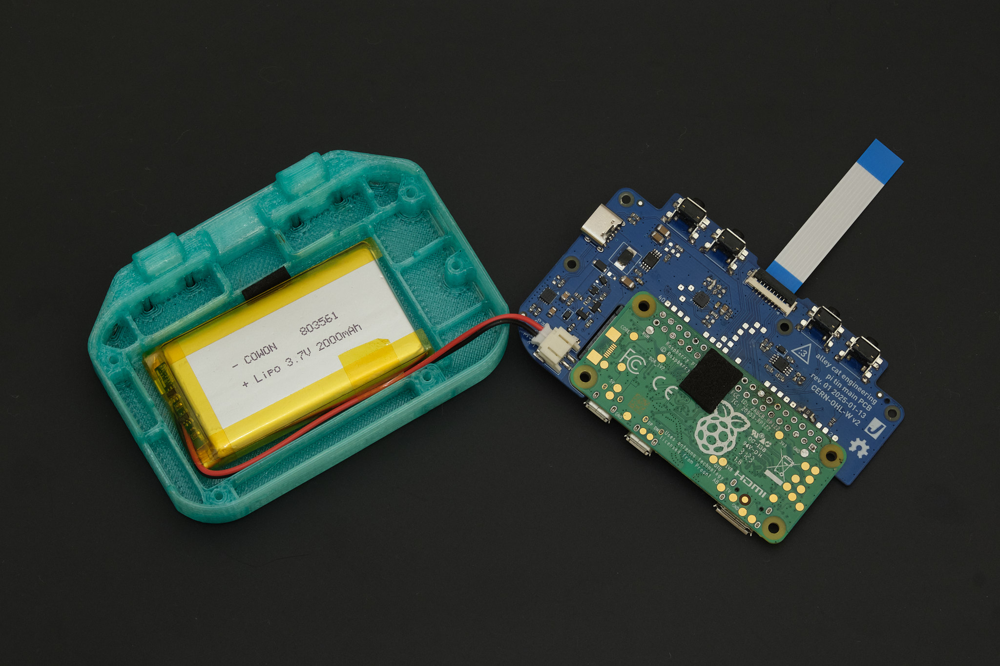

# Pi Tin Final Assembly (3D Printed Version)

## 1. test fit the PCB

Fit the Main PCB assembly into the lower case by inserting the PCB at an angle, USB port side first, and tilting it into place. Loosely insert M2x12 socket head cap screws into the two uppermost screw holes to align the PCB with the case. Verify that all four of the rear buttons can be clicked. If they stick or require excessive force, it is likely because of stringing or blobs of plastic inside the narrow cuts the form the buttons in the 3D printed part. Use fine point tweezers, a craft knife, or dental floss to clear the obstructions.

*Troubleshooting Note: If one of the buttons still gets stuck, it may be due to poor alignment of the Main PCB and Raspberry Pi putting pressure on the tactile switch. In this case, try shimming the PCB by inserting a small piece of paper or tape between the edge of the PCB near the button and the lower case in the next step.*

## 2. battery installation

Remove the PCB and screws from the lower case and apply a 6x10mm piece of EPDM foam tape as shown below to cushion the battery.

### if using 803561 size battery (currently included in kits)

Taping the wires along the edge of the battery as shown below is not necessary, but will help with the next steps.

Insert the battery into the lower case as shown, with the wires running along the bottom edge of the battery compartment.

Connect the battery to the Main PCB. Apply a 6x10mm piece of foam tape to the rear of the Raspberry Pi as shown to cushion the battery. Disconnect the display cable from the Display PCB (lift the black retention flap on the connector, then remove the cable) and connect it to the Main PCB.

### if using 803860 size battery

Insert the battery into the lower case with the wires facing to the right. Coil the wires as shown and connect the battery to the Main PCB. Disconnect the display cable from the Display PCB (lift the black retention flap on the connector, then remove the cable) and connect it to the Main PCB.

## 3. lower case assembly

Insert the Main PCB assembly into the lower case. **Ensure that the battery wires do not become pinched between the PCB and case or battery.**

The Main PCB assembly should ideally fit snugly inside the lower case. If it is loose, plug a USB-C cable into the connector to help with the next step. Turn the lower case assembly upside down and place it onto the assembled front panel. While holding the lower case and front panel together, insert the five M2x12 socket head cap screws into the bottom side of the case and tighten them in a star pattern. Do not overtighten the screws.

*Note: Some downward pressure is required when tightening the screws for the first time since they are threading directly into plastic.*

Check that the buttons on the front panel are not stuck. If they are, it is likely due to misalignment of the 3D printed membrane or defects on the 3D printed parts that need to be trimmed off.

## 4. display assembly

*Note: Rev. 1 Display PCB shown, Rev. 2 is smaller but the relative position of the connectors is the same.*

Remove the protective film from the display. Fold the display FPC (orange ribbon cable) over the back of the display and place the display assembly into the display bezel, aligning the display cable connector with the cutout on the bezel. Connect the display cable to the Display PCB.

Place the display housing over the display bezel, aligning the cutout in the housing with the display cable. Flip the assembly over and insert the four M2x4 socket head cap screws into the display bezel. Tighten the screws in a star pattern.

## 5. final assembly

Align the display housing with the mounting points on the lower case, folding the display cable forward as shown. Insert and tighten the two M2x20 socket head cap screws that hold the display hinge together.

