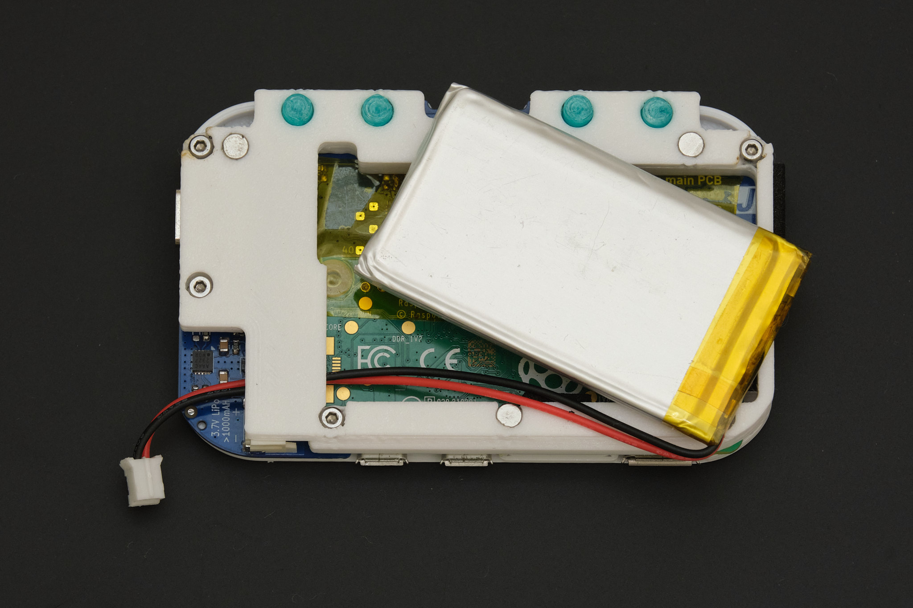
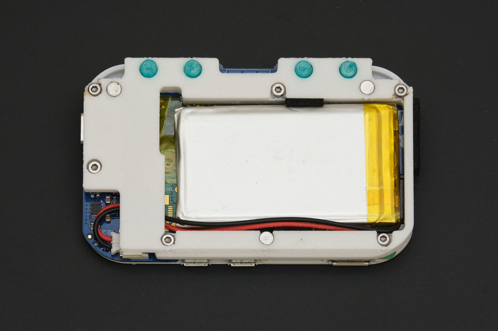

# Pi Tin Final Assembly (Altoids Tin Version)

**Important: Clean surfaces with isopropyl alcohol before using glue or double-sided tape.**

## 1. complete the Main PCB assembly

Insert three 4x2mm neodymium disc magnets into the rear housing as shown, applying a small dab of cyanoacrylate glue to hold each one in place.

### if using 803561 size battery (currently included in kits)

Insert the four rear buttons into the rear housing, then pick up the front panel and Main PCB together and mate them with the rear housing. The components should fit together closely without applying any force. Insert six M2x8mm socket head cap screws into the counterbore holes on the rear housing and tighten them in a star pattern. Do not overtighten the screws - stop tightening as soon as no gaps are visible between the edges of the 3D printed parts and the PCB.

*Note: Some downward pressure is required when tightening the screws for the first time since they are threading directly into plastic.*

Check that the buttons on the front panel are not stuck. If they are, it is likely due to misalignment of the 3D printed membrane or defects on the 3D printed parts that need to be trimmed off.

Thread the battery wires through the gap between the rear housing and PCB as shown.

Apply two 6x10mm pieces and one 18x10mm piece of EPDM foam tape in the locations highlighted in blue below to cushion the battery and keep the assembly centered inside the mint tin. Connect the battery to the main PCB, insert it into the battery compartment, and tuck the wires in place along the side of the battery.

### if using 803860 size battery

[Follow old instructions](./altoids_old_battery_installation.md)

## 2. prepare the Altoids tin

Align the 3D printed drill template with the tin as shown and use a marker to transfer the hole locations for the USB port and rear buttons to the tin. Mark the center of the holes using a center punch, scribe, or the tip of a drill bit. If using an automatic center punch, ensure that the metal is supported from the other side as it will leave dents in the tin otherwise.

If you have one, we recommend used a rotary tool with a fine-point abrasive bur to create the holes instead of drilling. Otherwise, drill all holes with a 1/16in (1.5mm) drill bit and then drill them out to 1/8in (3mm), using gradually increasing drill bit sizes if possible. Use a countersink bit to enlarge the four rear holes to approximately 3/16in (5mm). Use flush wire cutters or a rotary tool to cut out the remaining tab of metal between the USB port holes. Using needle files or a rotary tool, file the USB port cutout to its final shape and debur the edges of the other holes.

Thoroughly clean the tin to remove any metal shavings.

## 3. install the lid stop

Attach the lid stop to the tin as shown using cyanoacrylate glue.

Insert the 4x2mm neodymium disc magnet into the lid clip as shown, applying a small dab of cyanoacrylate glue to hold it in place.

## 4. display

*Note: Rev. 1 Display PCB shown, Rev. 2 is smaller but the relative position of the connectors is the same.*

Connect the display to the display PCB if it is not already, following the instructions in the electronics build guide. Use thin double-sided tape to attach the Display PCB to the rear of the display in its natural resting position, as shown below. The display FPC (orange ribbon cable) should lay flat and must **not** be under any tension. The Display PCB should not overhang the edges of the display module and the display interconnect cable should be roughly centered with the viewing area of the display.

**Rev. 2 PCB**

**Rev. 1 PCB** (shown from here on out)

Apply thin double-sided tape to the top of the Display PCB or to the corresponding surface on the display mount). Attach the display mount as shown, ensuring that the LCD module is aligned with the two flanges on either side of the display mount. Any vertical misalignment may result in the LCD getting damaged when the tin is closed.

Apply thin double-sided tape to the display mount. Attach it to the inside of the Altoids tin lid so that the display cable is horizontally centered within the tin.

**Important: Do not glue the display mount into the tin using cyanoacrylate glue. If you do, it will be nearly impossible to access the display cable connector if the display FFC cable breaks or gets pulled out of the connector.**

**Note: When installed correctly, the display module will appear off center. This is intentional and the actual viewing area of the display will be centered as shown below.**

## 5. final assembly

Connect the display cable to the Main PCB following the same steps used to connect it to the Display PCB. You may need to use tweezers to reach the locking flap on the connector. Insert the Main PCB assembly into the Altoids tin. It is easiest to insert the bottom edge (Raspberry Pi side) first at an angle and then tilt the assembly into place. Check that the rear buttons and USB port line up with the cutouts and that the Main PCB assembly is sitting flush with the base of the tin. Check that the tin is still able to close, making sure that the display cable folds into the space between the front panel and the display instead of being pinched between the display and the tin.

The lid clip is designed to hold both the Main PCB assembly and lid of the tin in place, so the rear buttons can be pressed without holding down the front panel and the Pi Tin can be used upside down. The lid clip attaches to the edge of the tin as shown and can be stowed in the space to the right of the display when not in use.

